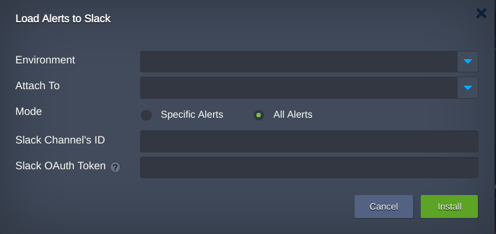
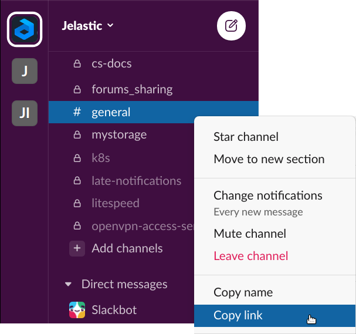
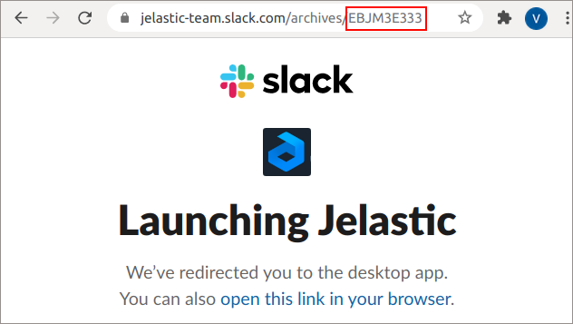
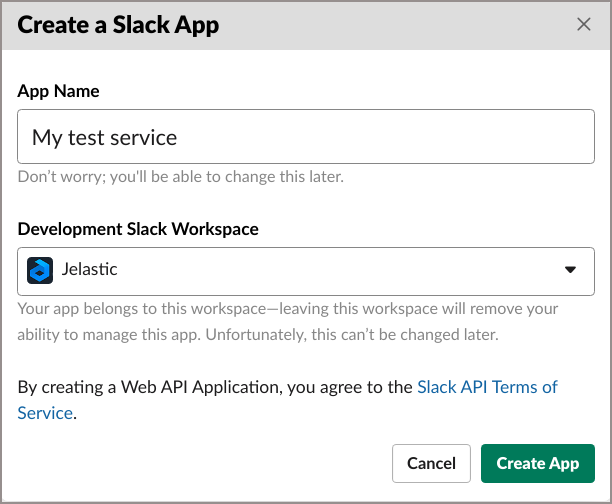
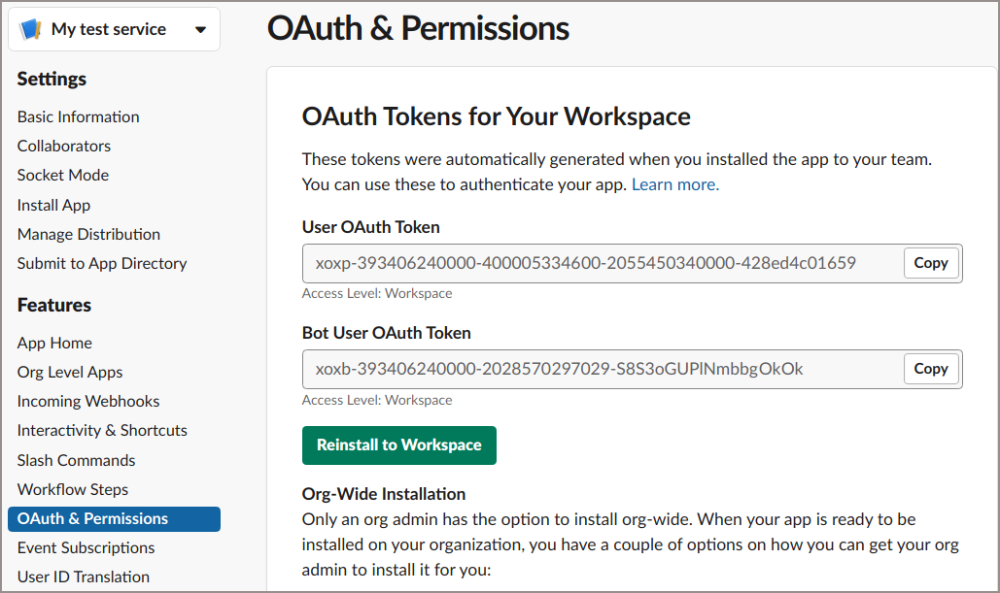
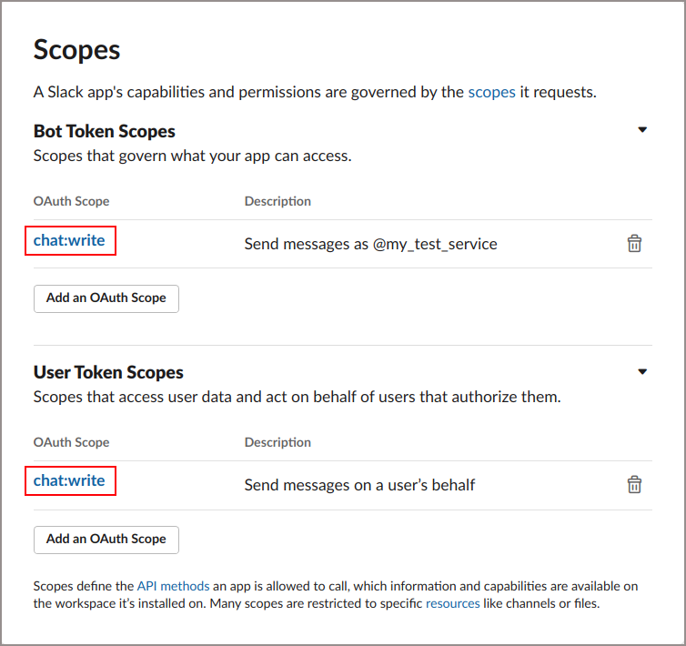
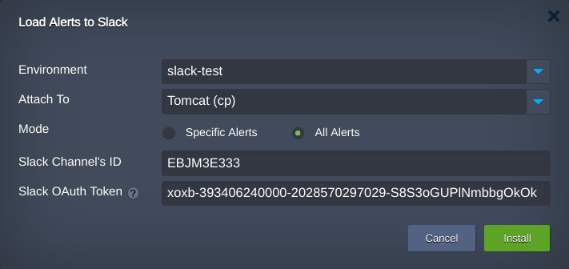
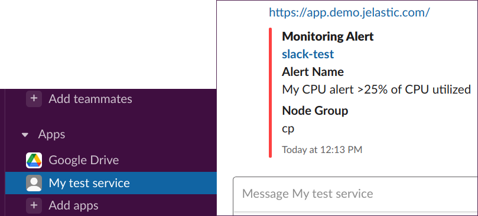

# Application Load Alert Notification Add-on for Slack (BETA)

Get automated alerts in Slack for a certain service isn’t working or resource limits are about to be exceeded when:  

 - CPU usage is too high
 - RAM consumption exceeds defined limits
 - High inodes usage
 - Disc utilization is next to the 100%
 - External network traffic is close to the expected limit
 
Such notifications are important because they inform the status of your production, and let you quickly fix what needs fixing. In most cases, Slack can be more convenient than emails because people often read them not so often compared to quick messages.

The installation can be performed on Jelastic certified containers.

## Installation Process
Import the [raw link of the add-on manifest](https://github.com/SlavaKatiukha/load-alerts-to-slack/blob/main/manifest.jps) within Jelastic PaaS dashboard.

  **Note**: to access the dashboard you need to be registered at one of the [Jelastic Public Cloud providers](https://jelastic.cloud) or have a Private Cloud installation.

In the opened confirmation window:

  1. Choose target environment and node the add-on should be attached to.
  2. Select any of mentioned  alerts or just use **All Alerts** option.
  3. Specify Сhannel ID you want to receive notifications on.
Channel ID can be extraceted from existing channel's link. Go to Slack and open link for any channel of required workspace:

  
  
  Get the channel ID as the last word in link.
  
  
  
  4. Sign in the required workspace and create an Application for your service by the following link: [https://api.slack.com/apps?new_app=1](https://api.slack.com/apps?new_app=1).
  
  
    
  5. Open **Features>OAuth & Permissions** and choose(Copy) token the messages should be sent from: either on behalf of application's name(**Bot User OAuth Token**) or your Slack user name(**User OAuth Token**).
  
  
  
  6. Depending on token, define the Slack application's capabilities and permissions via respective scopes. For example: **chat:write**.
  
  
  
  7. Go back to Jelastic dashboard and paste token to the **Slack OAuth Token** field.
  

  **Note**: The bot user tokens represent a bot associated with the application installed within a workspace. Compared to user tokens, they're not tied to a user's identity; they're just tied to your application and allow your app to stay installed even when an installing user is deactivated. So, using the bot tokens is better choice.
  
  8. Once installation is finished you will observe notifications in Slack client software regarding the [load alerts configured](https://docs.jelastic.com/load-alerts/) for your application.
  

 
  
Try out the Slack integration add-on within [Jelastic Multi-Cloud PaaS](https://jelastic.com) for any application.
